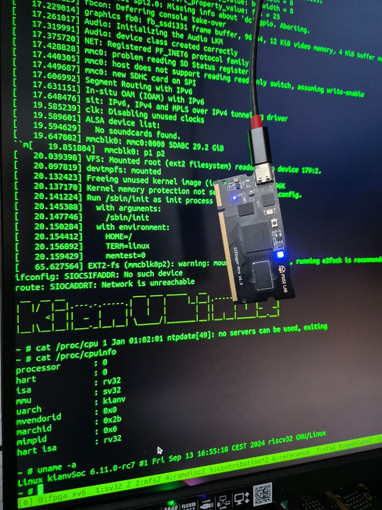

RISC-V Linux SoCs: uLinux and MMU Linux.
=========================================
```
 __  __ __               ___ ___ _____   __
|  |/  |__|.---.-.-----.|   |   |     |_|__|.-----.--.--.--.--.
|     <|  ||  _  |     ||   |   |       |  ||     |  |  |_   _|
|__|\__|__||___._|__|__| \_____/|_______|__||__|__|_____|__.__|
```
If you're interested in trying out the KianV SV32 (MMU) RV32IMA Zicntr Linux SoC, complete with virtual memory support, check out the link here:
[KianV SV32 RV32IMA Zicntr.](https://github.com/splinedrive/kianRiscV/tree/master/linux_socs/kianv_mc_rv32ima_sv32).

With KianV RISC-V uLinux, booting Linux is not just possible, it's exhilarating. That's right! If you've ever wanted to experience Linux booting in a whole new light, this is your chance.
Dive deep into the [implementation details here](https://github.com/splinedrive/kianRiscV/blob/master/linux_socs/kianv_harris_mcycle_edition/README.md).
