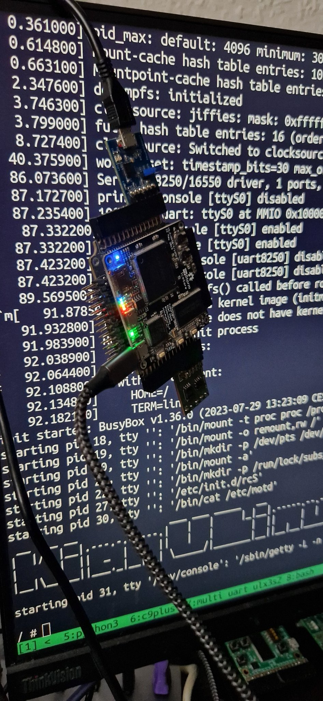
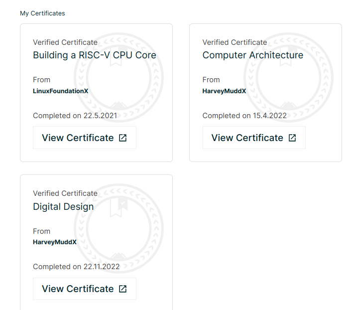

KianV Linux RISC-V Harris Edition (SOC)
RISC-V is an open standard instruction set architecture (ISA) based on 
reduced instruction set computer (RISC) principles. 
After successfully earning my **HarveyMuddX-ENGR85B** certification, 
I acquired the skills to design a hierarchical RISC-V CPU.

In the previous year, I completed an exam on **Building a RISC-V CPU Core**. 
This experience led me to refine my prior RISC-V SOC, the kianv simple edition. 
This initial endeavor was a significant learning curve, crafted through trial and error without simulation. 
It provided invaluable insights into **logical design** thinking.
[Review the archived implementation.](https://github.com/splinedrive/kianRiscV/tree/master/archive).



RISC-V Linux SoCs: uLinux and MMU Linux.
=========================================
```
 __  __ __               ___ ___ _____   __
|  |/  |__|.---.-.-----.|   |   |     |_|__|.-----.--.--.--.--.
|     <|  ||  _  |     ||   |   |       |  ||     |  |  |_   _|
|__|\__|__||___._|__|__| \_____/|_______|__||__|__|_____|__.__|
```
## KianV RISC-V Linux: Booting Linux like never before!
If you're interested in trying out the KianV SV32 (MMU) RV32IMA Zicntr Linux SoC, complete with virtual memory support, check out the link here:
[KianV SV32 RV32IMA Zicntr.](https://github.com/splinedrive/kianRiscV/tree/master/linux_socs/kianv_mc_rv32ima_sv32).

With KianV RISC-V uLinux, booting Linux is not just possible, it's exhilarating. That's right! If you've ever wanted to experience Linux booting in a whole new light, this is your chance.
🔗 Dive deep into the [implementation details here](https://github.com/splinedrive/kianRiscV/blob/master/linux_socs/kianv_harris_mcycle_edition/README.md).
🎥 Or, if you're more of a visual learner, [watch the Kian Linux Soc in action!](https://twitter.com/i/status/1649359364010983424)

# Some Hardware designs can be found here
[Hardware designs](https://github.com/splinedrive/kianRiscV/blob/master/pcb)
