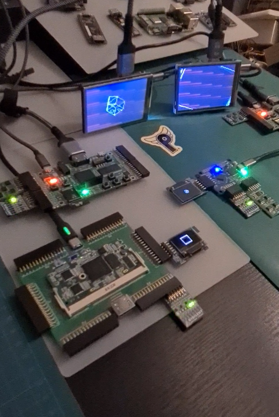

[](./kianv_soc.mp4)
# kianv RISC-V Harris MultiCycle Edition (SOC)
RISC-V is an open standard instruction set architecture (ISA) according to
the principles of reduced instruction set computer (RISC) principles.
Afterward when I sucessfully completed my **HarveyMuddX-ENGR85B** Exam certificate.
I learned howto design a RISC-V CPU **hierarchical**.
Last year I have sucessfully completed an exam in **Building a RISC-V CPU Core**
and finalized my previous RISC-V soc [kianv simple edition](https://github.com/splinedrive/kianRiscV/tree/master/archive/simple).
But was a hack and got much experience. The code was created by try and error without simulation and
was a good experience to think in **logical design**.


Linux SOC
=========
under linux_socs

CPU
===
The processor supports `RV32IM` instruction set

* `RV`: RISC-V
* `32`: 32-Bit registers, 3-address instructions
* `I` : integer instructions
* `M` : multiply/divide/modulo instructions

and passes the RISC-V [unit tests for RISC-V processors](https://github.com/riscv-software-src/riscv-tests).
The cpu is implemented with strong hierarchical method design rules I have learned from **Computer
Architecture RISC-V Edition**, Harris, Harris. As you can see here (taken from my exam documents):
<figure>
Harris MultiCycle RISC-V Architecture</figcaption>
</figure>

Verilog Implementation
======================
My architecture will presented by following verilog files:

* kianv_harris_mc_edition.v
  * control_unit.v
    * alu_decoder.v
    * csr_decoder.v
    * divider_decoder.v
    * load_decoder.v
    * main_fsm.v
    * multiplier_decoder.v
    * multiplier_extension_decoder.v
    * store_decoder.v
  * datapath_unit.v
    * alu.v
    * csr_unit.v
    * design_elements.v
    * divider.v
    * extend.v
    * load_alignment.v
    * multiplier.v
    * register_file.v
    * store_alignment.v

Register Transfer Logik (RTL)
=============================
Some examples of CPU components shown in RTL of the top layer of the cpu,
control unit, data unit and the main finite state machine (FSM) here:

# Top CPU Layer
The top layer of the CPU consist only from a control unit and data unit.
<figure>

<figcaption>Top Layer from Kianv RISC-V CPU</figcaption>
</figure>

# Control Unit
The control unit controls the complete data flow of the CPU and
consits of a main FSM and many decoders.
<figure>
ControlUnit</figcaption>
</figure>

# Main FSM
The most important unit is the main FSM and is a part of the control unit.
It controls the sequence of `fetch`, `decode`, `execution` and `write back`.
<figure>
Main FSM</figcaption>
</figure>

# Data Unit
The data unit consits of units are perform operations on data and store elements,
<figure>
DataUnit</figcaption>
</figure>

# FPGA-Soc Implementation
The soc has some controllers implemented:

* nor spi controller
* oled spi controller
* psram qspi controller
* direct map cache controller
* hdmi framebuffer controller, vga controller
* tx uart controller up to 3MBaud
* spram controller (ice40up)

Supported **fpgas**:

* ulx3s ecp5
* icebreaker ice40
* colorlighi5, colorlighti9 ecp5
* icefun ice40
* digilent arty7, nexys a7 nexys video, CmodA7-35t and genesys2

## Synthesis of SOC
You should study `defines.vh` file you can choose the sytemfrequency,
hdmi or oled on ulx3s, psram with/without cache, cachesize, ...

Please use [oss-cad-suite](https://github.com/YosysHQ/oss-cad-suite-build) to have all
tools for synthesis.

```bash
cd gateware
./build_ulx3s.sh    # build ulx3s and flash design
./build_ice.sh      # build icebreaker and flash design
./build_colori9.sh  # build colorlighti9 and flash design
./build_colori5.sh  # build build_colori5 and flash design
./build_fun.sh      # build icefun and flash design
```

## Simulation of whole SOC
```bash
./sim.sh # for iverilog simulation
./verilator.sh # for verilator simulation
```
## Simulation of CPU only
```bash
cd kianv_harris_mcycle_edition
./sim.sh # for iverilog simulation
```
### Unittest of CPU
This will test all supported instructions of a `RV32IM` user mode CPU.
Took the **picorv32** test cases and adjusted them for my testbench.
```bash
cd kianv_harris_mcycle_edition
cd firmware
. ./start_test.sh
```

## Toolchain

Build [RISC-V GNU toolchain](https://github.com/riscv/riscv-gnu-toolchain)
Invoke the build_toolchain.sh script to have a riscv toolchain for rv32im
and will build under /opt/riscv32im
```bash
cd ./kianv_harris_mcycle_edition/firmware/
./build_toolchain.sh
```

Or use another toolchain
and adjust:\
```bash
./firmware/kianv_firmware_bram_gcc.sh
./firmware/kianv_firmware_gcc.sh
```
## Trying Firmware
The firmware will flashed on nor memory!
Firmware:\
```bash
cd ./firmware\
flash with\
./flash_firmware.sh \
ulx3s|ice|colori5|arty7|nexysa7|nexysa_video|genesys2|cmoda7_35t| stick <*.ld> <*.c>

spi_nor2bram_fun.ld # boot from spi-nor icefun and copy code to bram\
spi_nor2bram.ld # boot from spi-nor icebreaker and copy to bram\
spi_nor2bram_colori5.ld # boot from spi-nor colorlighti5 also ulx3s and copy to bram\
spi_nor2spram.ld # boot from spi-nor icebreaker and copy to spram\
spi_nor2sram.ld # boot from spi-nor and copy to sram icoboard\
spi_nor_fun.ld # boot and execute instructions only from spi-nor on icefun\
spi_nor.ld # boot and execute instructions only from spi-nor all boards, excluded icefun
spi_nor2spram.d # boot from spi and copy to spram (only icebreaker, ice40up)
spi_nor2psram.d # boot from spi and copy to psram
spi_nor_ice40hx1k.ld # boot and execute instructions only from spi-nor, e.g. icestick
```
Try for icestick all mandel, raytracer, main_seed.c oled or uart demos.
Firmware is very restricted, will hang currently if you use hw registers they are not implemented.
icestick could be configured as soc with oled xor uart.
icestick is configured as rv32i and needs rv32i toolchain which will selected in flash_firmware. 
```
 ./flash_firmware.sh stick spi_nor_ice40hx1k.ld main_raytrace.c -Ofast # would flash firmware for icestick and uses the rv32i firmware
```
## Preparing Uart
some programs are using external uart hw, check pcfs but icebreaker, breakout and ulx3s don't need
external uart hw. Check for ttyUSB devices and try
```bash
stty -F /dev/ttyUSBx 11520 raw\
cat /dev/ttyUSBx
```
latest fw version needs no raw mode anymore!
```bash
stty -F /dev/ttyUSBx 11520 \
cat /dev/ttyUSBx
```

to get output like pi.c, main_prime.c, main_rv32m.c, main_rv32m_printf.c, ....


## GPIO interface
Added a generic purpose io interface for each soc. You can drive the IOs from firmwarespace. The firmware folder
provides an i2c and spi lib.
There are some bitbang examples like to drive via i2c a liquidchrystal or an oled sdd1306 display.
The highlight is the spi bitbanging example to read, write files from fat16/32 sd card...The driver
is from ultraembedded I stripped down to an one file implementation.
Check the .pcf or .lcf files to remap or to expand the ios to 32 with current implementation.

## DMA Controller
KianRiscV has an optional DMA-Controller to speedup memset, memcopy wordwise!

## PMODs
* PSRAM 32MByte: https://machdyne.com/product/qqspi-psram32/

## Xilinx
Check the XilinxVivado folder and
```bash
./build.sh
```

Kian RiscV Single Cycle CPU
===========================
Check the new single cycle CPU with CPI=1 and 
prepared for a KINTEX-7. You can also run smaller FPGAs with
less firmware. Firmware can build with standard BRAM linker script
and reset address 0. Raytracer is still their as hex got from 
https://github.com/WyattAutomation/Simple-Raytracer-in-C.git. 
I have provided a 80MHz bitstream file with firmware for genesys2.
The CPU operates with 80MHz => 80 MIPS and 3000000 Baud uart!
### Simulation
```bash
cd kianv_harris_scycle_edition/processor/
make verilator && ./obj/Vtop
```
or 
```bash
cd kianv_harris_scycle_edition/processor/
make isim && ./a.out
```


Kian RiscV 5-staged Pipelined CPU
==================================
This is a 5-staged pipelined cpu and is the base of my future work.
The cpu is rv32i complaint and tested with the riscv testsuite. In future I will share
an advanced soc from it: interrupts, sdram/ddr, caches, branch predition,
linux bootable.


Hirosh
