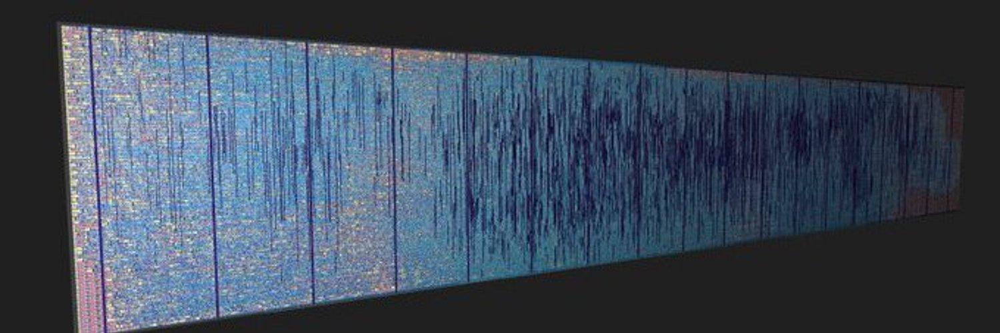

You'll own nothing and be happy!
================================
I am a professional embedded systems engineer. I started in 2021 with logic
design, motivated to learn. My goal was to implement a RISC-V Linux SoC because I love
Linux. Now, that goal has come true. In the future, I aim to work on advanced
designs and improvements, step by step.

## Star History

<a href="https://star-history.com/#splinedrive/kianRiscV&Date">
 <picture>
   <source media="(prefers-color-scheme: dark)" srcset="https://api.star-history.com/svg?repos=splinedrive/kianRiscV&type=Date&theme=dark" />
   <source media="(prefers-color-scheme: light)" srcset="https://api.star-history.com/svg?repos=splinedrive/kianRiscV&type=Date" />
   
 </picture>
</a>

**RISC-V ASIC/FPGA uLinux/MMU Linux/XV6 SoCs:**
===========================================
Explore the **KianV SV32 (MMU) RV32IMA Zicntr Zicsr Zifencei SSTC Linux/XV6
SoC**, featuring full virtual memory support and compatibility with Linux and
XV6. Whether you're into RISC-V development or SoC design, this project is
worth checking out. Find it here:

👉 [KianV SV32 RV32IMA Zicntr Zicsr Zifencei SSTC](https://github.com/splinedrive/kianRiscV/tree/master/linux_socs/kianv_mc_rv32ima_sv32)

🚀 **Discover the KianV RISC-V uLinux SoC!** 🚀
Dive into my RISC-V SoC journey:
- 🖥️ Explore the **FPGA implementation details**: [KianV FPGA SoC](https://github.com/splinedrive/kianRiscV/blob/master/linux_socs/kianv_harris_mcycle_edition/README.md)
- 🏭 Check out my **uLinux ASIC created with TinyTapeout**: [KianV ASIC Designs](https://github.com/splinedrive/kianRiscV/tree/master/asic)
From FPGA to ASIC, it's all here!


```
 __  __ __               ___ ___ _____   __
|  |/  |__|.---.-.-----.|   |   |     |_|__|.-----.--.--.--.--.
|     <|  ||  _  |     ||   |   |       |  ||     |  |  |_   _|
|__|\__|__||___._|__|__| \_____/|_______|__||__|__|_____|__.__|
```

