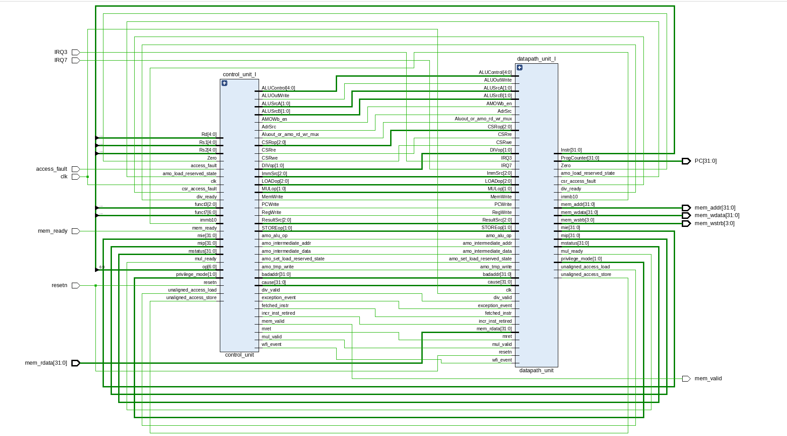
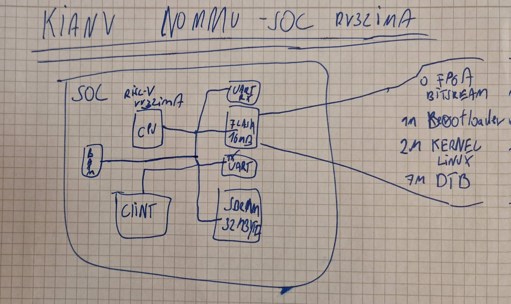

 Here is an RV32IMA RISC-V processor that can boot and run uLinux, 
 initially for the ULX3S 85F. The thing can be easily ported to other platforms. 
 The images for the operating system can be found under the demo directory with instructions.

 I started with logic design in 2020. I got an Orange Crab and ran Litex Linux
 on it. I was speechless. I didn't really know what an FPGA was yet. I had done
 some logic design in my studies and a lot of electrical engineering, computer
 architecture, etc., but I never really had an interest in FPGAs because I
 focused on software modules in my studies. In 2021, I started with my first
 CPU, which I learned through my edX course: Building a RISC-V Core, followed by
 courses from Harris, Computer Architecture, and Digital Design. I have done
 many designs in my spare time in the evenings. Actually, I am an embedded
 software developer and develop kernel drivers and many other low-level
 programs. The idea of booting Linux was actually born from the beginning, as I
 love Linux and am a big Unix admirer. My idols are Ken Thompson and Seymour
 Cray, among many others. I also spend a lot of time with computer history
 because I find the machines very fascinating. In the end, my hobby is the
 fulfillment of my childhood, as I always wanted to know how such a machine
 works. I always read articles in magazines, but that was too abstract for me.
 It's much better if you develop a CPU system yourself, then you can feel and
 understand it.

<figure>
KianV Multicycle rv32ima CPU</figcaption>
</figure>
<figure>

Last year in the fall, I completed my 5-stage pipeline CPU and wanted to create
a Linux-capable system from it. However, I abandoned the project because I
lacked the knowledge of what is needed for Linux. I had worked with other
designs, such as PSRAM and SDRAM, and implemented them. Then I got MicroPython
running on my SoC at the time. There, I learned how to interactively communicate
with the CPU via UART. This laid the foundation for a Linux system. I then
started studying ice40linux and expanded it with PSRAM and an AXI Light Burst
interface. That was a good learning experience.

Then I read a book about operating systems and memory concepts. I then worked
with xv6 as an operating system in QEMU and learned about privilege modes. I
began creating an emulator based on QEMU, ultraembedded, minirv32im, etc., from
scratch and only then understood what !mmu Linux is. I always wanted a proper
Linux system. However, I recognized the potential in it, as the privilege
concepts don't differ semantically, except that the supervisor mode is not used,
and it only makes sense with an MMU. After my emulator booted !mmu
Linux, I was very happy and started to expand my old multicycle CPU to
!mmu. I succeeded in doing so. I was able to use my buildroot from
minirv32 without any modifications. Through minirv32, I learned about
the relevant hardware addresses and dtb handling.
Regym's patch was the starting point, and he was the first to have an !mmu SoC.
However, I couldn't benefit from it because I didn't understand it. The
understanding came with the emulator.

Furthermore, I would like to express my sincere gratitude to my chat friend
darkriscv for his patience and the evening chats we've had.

check his repo out: https://github.com/darklife/darkriscv

Resources I have used:

- https://github.com/smunaut/iCE40linux
- https://github.com/splinedrive/iCE40linux
- https://www.five-embeddev.com/riscv-isa-manual/latest/machine.html
- https://courses.cs.duke.edu/fall22/compsci510/schedule.html
- https://github.com/jameslzhu/riscv-card
- https://danielmangum.com/posts/risc-v-bytes-qemu-gdb/
- https://www.qemu.org/docs/master/system/target-riscv.html
- https://riscv.org/technical/specifications/
- https://starfivetech.com/uploads/sifive-interrupt-cookbook-v1p2.pdf
- https://github.com/ultraembedded/exactstep
- https://github.com/qemu
- https://github.com/pulp-platform/clint
- https://gitlab.com/x653/xv6-riscv-fpga
- https://github.com/regymm/quasiSoC
- https://pdos.csail.mit.edu/6.S081/2020/xv6/book-riscv-rev1.pdf
- https://github.com/cnlohr/mini-rv32ima

and many more!
