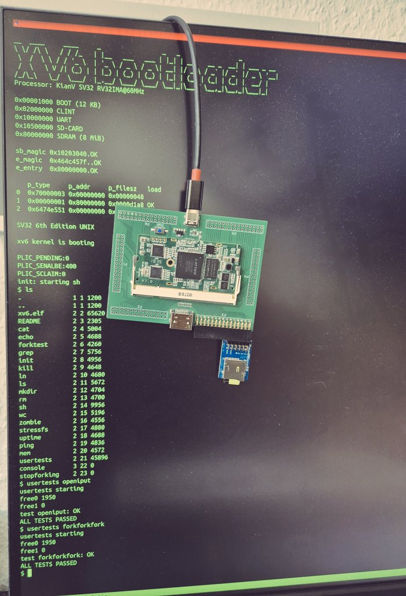

Welcome to the repository for the xv6 SoC on KianV RISC-V RV32IMA! This project
provides binary images and instructions to run the xv6 operating system on the
KianV RISC-V platform with the Colorlight i5 board. Below, you'll find the
steps to load the FPGA bitstream and flash the filesystem image.

xv6 is a simple Unix-like operating system used primarily for educational
purposes, and here, it's been ported to run on the KianV RISC-V platform. The
Colorlight i5 board serves as the hardware foundation for this SoC.

Step 1: Load the FPGA Bitstream
The FPGA bitstream file (soc.bit) configures the FPGA with the SoC design. Use the openFPGALoader tool to load this bitstream onto your Colorlight i5 board.

Command:
```
openFPGALoader --board=colorlight-i5 -f soc_colorlighti5.bit
```

Step 2: Flash the Filesystem Image
The filesystem image (fs.img) contains the xv6 root filesystem. Use the dd command to write this image to your storage device.

Command:
```
sudo dd if=fs.img of=/dev/sdx
```

Step 3: Boot the System
Once the bitstream is loaded onto the FPGA and the filesystem image is flashed
to your storage device, you can boot the system. Connect your storage device to
the board, power it up, and enjoy running xv6 on the KianV RISC-V SoC.


Connect to it via UART with the following command:
```
tio -m INLCRNL -o 1 /dev/ttyUSB0 -b 115200
```

You also need an SD card PMOD. I used the PMOD from Digilent. You can see in
the picture how to connect it to the motherboard.



